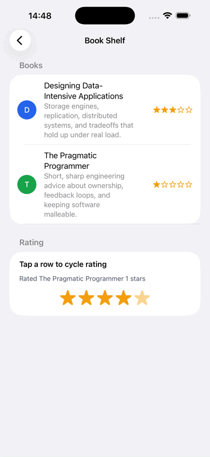

# Super Native Books

A small NativePHP Mobile demo that turns the Super Native starter app into a native book shelf. The demo focuses on native list items, row actions, a bottom sheet editor, and an animated star rating pattern.

Repository: [github.com/Matildevoldsen/super-native-books](https://github.com/Matildevoldsen/super-native-books)

## Demo

This GIF is captured from the actual iPhone 17 Pro Max simulator run. It shows rating changes, the edit sheet, and row actions in the native UI.



## What It Shows

- A `/books` native route powered by `App\NativeComponents\BookShelf`.
- Native `list` and `list-item` rendering with monograms, supporting text, trailing star ratings, and row actions.
- A bottom sheet editor with title, description, save/cancel controls, and tappable animated stars.
- Swipe action handlers for edit and delete, backed by tested component methods.
- A launcher entry in the demo home screen so the book shelf is reachable from the existing Super Native UI.

## Setup

```bash
git clone https://github.com/Matildevoldsen/super-native-books.git
cd super-native-books
composer install
php artisan native:install ios --no-interaction
```

Run it on an iOS simulator:

```bash
xcrun simctl list devices
php artisan native:run ios <simulator-udid> --start-url=/books --no-tty --no-interaction
```

The GIF in `docs/assets` was captured from an iPhone 17 Pro Max simulator after launching the `/books` route.

## Main Files

```text
app/NativeComponents/BookShelf.php
resources/views/native/book-shelf.blade.php
routes/web.php
app/NativeComponents/DemoLauncher.php
tests/Feature/Native/BookShelfTest.php
tests/Feature/Native/DemoScreensSmokeTest.php
docs/assets/
```

## Verification

```bash
php artisan native:validate --component=BookShelf
php artisan test tests/Feature/Native/BookShelfTest.php tests/Feature/Native/DemoScreensSmokeTest.php
php artisan test
./vendor/bin/pint --test app/NativeComponents/BookShelf.php resources/views/native/book-shelf.blade.php tests/Feature/Native/BookShelfTest.php tests/Feature/Native/DemoScreensSmokeTest.php
```

The latest local verification passed with 79 tests and 368 assertions.

## License

MIT
